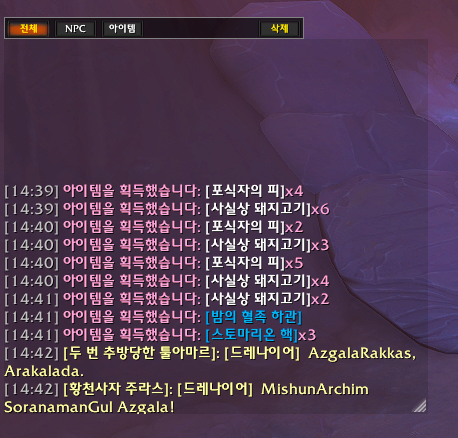
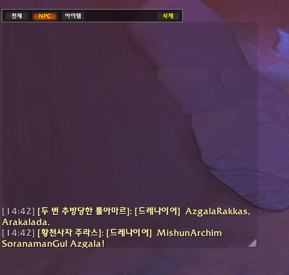
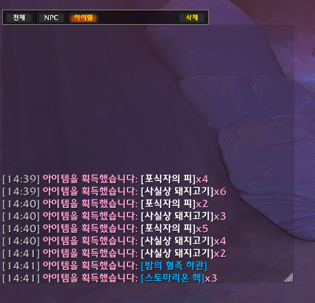
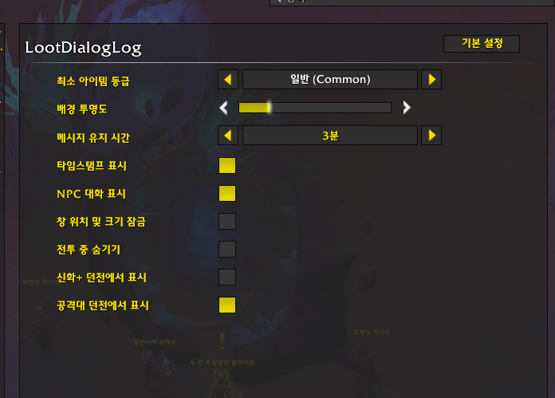

# LootDialogLog

[English](#english) | [한국어](#korean)

---

## English

LootDialogLog is a World of Warcraft addon that captures loot information and NPC dialogues into a separate, manageable log window.

### 🌟 Key Features

#### 1. Log Recording & Display
- **Item Looting**: Displays looted item links with the character's class color for better readability.
- **NPC Dialogues**: Distinct colors for different types of monster chat:
  - Say: |cffffff9fLight Yellow|r (ffffff9f)
  - Yell: |cffff4040Red|r (ffff4040)
  - Whisper: |cffffb5ebPink|r (ffffb5eb)
- **Language Support**: Displays the language tag (e.g., `[Draenei]`) for NPC dialogues.

#### 2. Filtering & Management (Header Button Bar)
Quickly filter or clear the log using the buttons at the top:
- **[All]**: Displays both loot and NPC dialogues.
- **[NPC]**: Shows only NPC dialogue history.
- **[Items]**: Shows only item loot history.
- **[Clear]**: Immediately clears all saved log entries.

#### 3. Auto-Expiration & Scrolling
- **Time-based Expiration**: Messages are automatically removed after a set duration (1, 3, 5, or 10 mins).
- **Scrolling**: Use the mouse wheel to scroll through logs.
  - `Mouse Wheel`: Scroll Up/Down
  - `Shift + Mouse Wheel`: Jump to Top/Bottom

#### 4. Detailed Options
Access via `Settings > Addons > LootDialogLog` or `/ldl`.
- **Min Item Quality**: Filter loot by quality.
- **Background Alpha**: Adjust the transparency of the window.
- **Log Retention Time**: Choose how long messages stay in the log.
- **Timestamp**: Toggle [HH:MM] format.
- **Window Lock**: Prevent accidental moving or resizing.
- **Instance Settings**: Enable/Disable specific behaviors for Mythic+ and Raids.

### ⌨️ Slash Commands
- `/ldl`: Opens the settings menu.
- `/ldl lock`: Toggles window lock.

---

## 한국어

LootDialogLog는 루팅한 아이템 정보와 NPC의 대화를 별도의 독립된 창에 기록하고 관리할 수 있게 해주는 월드 오브 워크래프트 애드온입니다.

### 🌟 주요 기능

#### 1. 로그 기록 및 표시
- **아이템 루팅**: 획득자의 직업 색상을 입힌 아이템 링크를 표시합니다.
- **NPC 대화**: 대화 유형별 색상 구분 및 언어 정보(예: `[드레나이어]`)를 포함합니다.
  - 일반 대화: |cffffff9f연한 노란색|r (ffffff9f)
  - 외치기: |cffff4040빨간색|r (ffff4040)
  - 귓속말: |cffffb5eb분홍색|r (ffffb5eb)

#### 2. 필터링 및 관리 (상단 버튼 바)
- **[전체]**: 모든 로그 표시.
- **[NPC]**: NPC 대화만 표시.
- **[아이템]**: 루팅 기록만 표시.
- **[삭제]**: 모든 기록 초기화.

#### 3. 자동 삭제 및 스크롤
- **시간 기반 삭제**: 설정한 시간(1, 3, 5, 10분) 후 메시지 자동 제거.
- **스크롤**: 마우스 휠 지원 (Shift 조합 시 맨 위/아래 이동).

#### 4. 상세 설정 (Options)
- **최소 아이템 등급**, **배경 투명도**, **유지 시간**, **타임스탬프**, **창 잠금**, **전투 중 숨기기**, **인스턴스별 표시 여부** 등 설정 가능.

### ⌨️ 명령어
- `/ldl`: 설정창 열기.
- `/ldl lock`: 창 잠금 토글.

---
*Screenshots should be placed in the `.github/images/` folder as `main_frame.png` and `options_menu.png`.*
